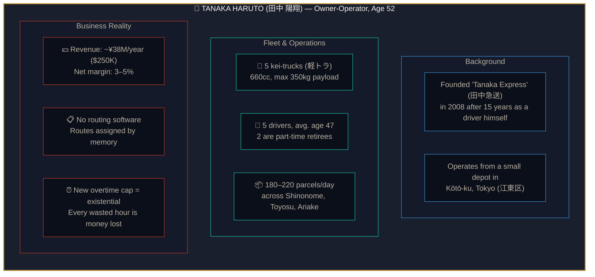
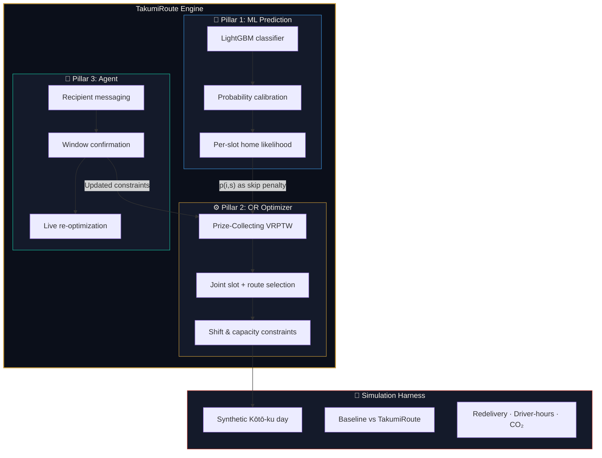
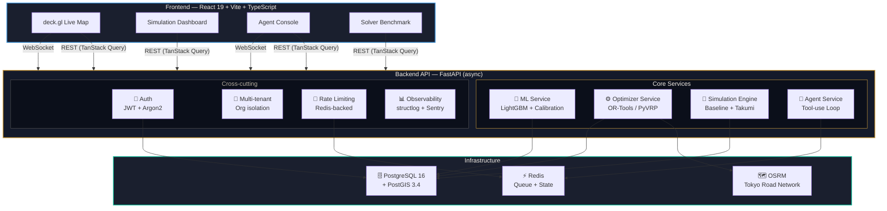
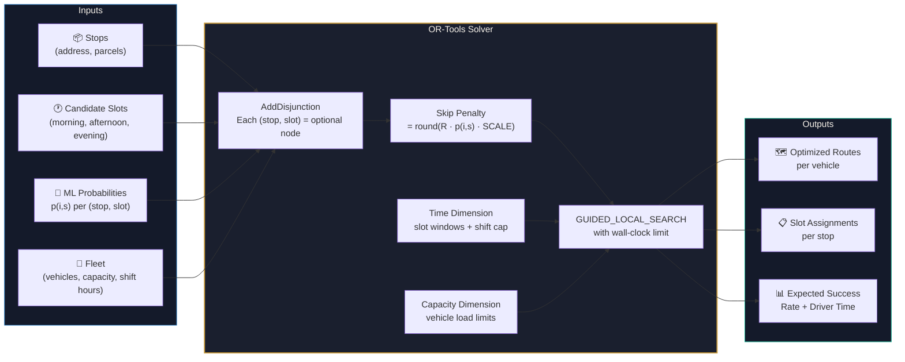
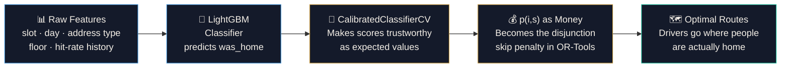
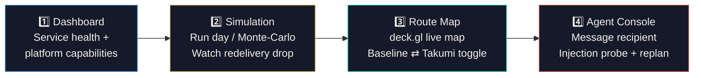
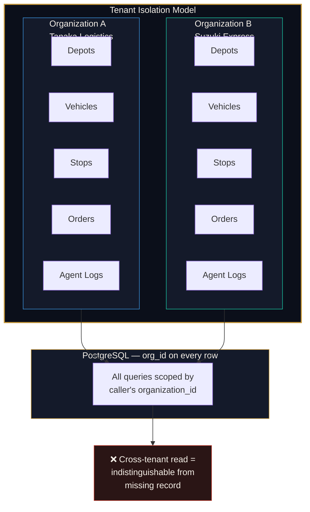
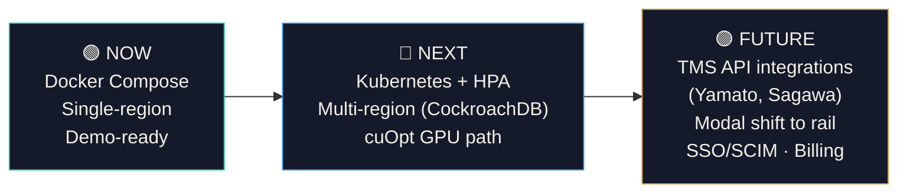

<p align="center">
  <h1 align="center">TakumiRoute 匠ルート</h1>
  <p align="center">
    <strong>First-attempt delivery optimization for Japan's last-mile logistics</strong>
  </p>
  <p align="center">
    <em>ML Availability Prediction · Prize-Collecting Route Optimization · Agentic Coordination</em>
  </p>
  <p align="center">
    <a href="#quick-start">Quick Start</a> · <a href="#demo-flow">Demo</a> · <a href="#architecture">Architecture</a> · <a href="#the-or-core--prize-collecting-vrptw">OR Core</a> · <a href="#security">Security</a>
  </p>
</p>

---

## Why TakumiRoute Exists

Japan is facing a logistics cliff. From **April 2024**, truck-driver overtime was legally capped at **960 hours/year** — a regulation known as the **"2024 Problem" (物流2024年問題)**. With over **90% of domestic freight** moving by road and an aging driver workforce, the Ministry of Land, Infrastructure, Transport and Tourism (MLIT) projects a **~14% transport-capacity shortfall in 2024**, rising to a staggering **~34% by 2030**.

Hidden inside this crisis is a quietly devastating inefficiency: **~8–9% of all parcels require redelivery (再配達)** because no one is home on the first attempt. Every failed delivery burns scarce driver-hours, adds CO₂, and widens the capacity gap — on trips that were already being made.

The industry is heavily fragmented: most carriers are **sub-10-person SMEs** running routes from memory, with zero routing software. TakumiRoute targets that gap.

> **The thesis:** You don't need more trucks or more drivers. You need to stop wasting the trips you already make. Fix first-attempt delivery success and you claw back capacity for free.

---

## Real-World Use Case: Meet Tanaka-san 田中さん

Japan's trucking industry isn't dominated by giants — **62,000+ carriers** operate nationwide, and the vast majority are small family-run businesses with fewer than 10 employees ([Japan Trucking Association](https://www.jta.or.jp/)). They don't have routing software. They don't have data scientists. They dispatch from memory, experience, and gut feel. TakumiRoute is built for them.

### The Persona



**Tanaka Haruto** is 52 years old. He spent 15 years driving delivery trucks across Tokyo before founding **Tanaka Express (田中急送)** in 2008 with a single kei-truck and a notebook. Today he runs five vehicles out of a small depot on a quiet street in Kōtō-ku — one of Tokyo's densest delivery zones, packed with apartment towers along the waterfront in Toyosu (豊洲), Shinonome (東雲), and Ariake (有明).

His five drivers — two full-timers in their 40s, one in his 30s, and two part-time retirees — deliver 180–220 parcels every day. Like most small carriers in Japan, Tanaka-san doesn't use routing software. He arrives at the depot at 5:30 AM, looks at the day's orders, and assigns routes from memory: *"Yamamoto takes Shinonome — he knows the building entry codes. Kobayashi handles Toyosu Tower — the concierge lets him batch-deliver."*

This worked for years. **Then the 2024 law hit.**

The new overtime cap means his drivers can't stay late to finish redelivery loops anymore. His margins — already razor-thin at 3–5% net on ¥38M annual revenue — are being squeezed from both sides: **drivers can't work more hours**, and **failed first attempts now cascade into the next day** instead of being absorbed by overtime.

> *"I used to tell Yamamoto 'just swing back at 7 PM, they'll be home by then.' Now I can't. His shift ends at 4. If the parcel fails at 10 AM, it fails for the day."*
> — Tanaka Haruto

### Tanaka-san's Service Area

His delivery zone spans three neighborhoods that perfectly represent Japan's last-mile challenge:

| Area | Character | Delivery Challenge |
|------|-----------|-------------------|
| **Toyosu (豊洲)** | New high-rise residential towers, young families | Both parents work; apartments empty 8 AM – 6 PM. Auto-lock buildings restrict lobby access. |
| **Shinonome (東雲)** | Mid-rise apartments, mixed demographics | Unpredictable schedules; retirees home in mornings, workers home only evenings. |
| **Ariake (有明)** | Waterfront commercial + residential mix | Office workers order to home address; near-zero daytime availability. |

Each neighborhood has a different "home probability signature" — and Tanaka-san's drivers learn these patterns over years. But that knowledge lives in their heads, is lost when they retire, and can't be optimized across the fleet.

### ❌ Tanaka-san's Day Without TakumiRoute

| Time | What Happens | Impact |
|------|-------------|--------|
| **5:30 AM** | Tanaka-san arrives at the depot. 196 parcels for the day. He assigns routes from memory, scribbling on printed manifests. | No data, no optimization — routes and time windows chosen by gut feel |
| **7:00 AM** | Driver Yamamoto-san loads his kei-truck: 42 stops across Shinonome. Tanaka-san tells him *"try the towers before 9, people leave for work around then."* | Delivery windows are carrier-guessed, not recipient-informed |
| **9:15 AM** | Yamamoto rings apartment 1204 in Shinonome Canal Court — no answer. Writes a redelivery slip (不在票), tucks it in the mailbox. This is the 3rd failure of the morning. | Each failure = 3–5 min wasted: park, walk to entrance, intercom, wait, write slip, walk back |
| **11:00 AM** | 6 out of 18 morning stops have failed. Yamamoto calls Tanaka-san: *"Shinonome towers are dead — everyone's at work."* Tanaka-san says *"skip to Ariake, come back at 3."* | Ad-hoc re-routing by phone. No data on when residents will actually be home. |
| **1:30 PM** | Yamamoto-san has completed 24 stops. 8 total failures. He grabs a konbini lunch and dreads the afternoon redelivery loop. | Driver morale drops. Redelivery loops feel futile — *"Am I just going to ring empty apartments again?"* |
| **3:30 PM** | Redelivery loop: 3 of the 8 now succeed (retirees came home for the afternoon). 5 still fail — the office workers won't be back until evening. | 5 parcels carry over to tomorrow, creating a backlog cascade |
| **4:00 PM** | Shift ends (overtime cap). Yamamoto logs 35/42 stops succeeded. | **16.7% redelivery rate.** 48 extra minutes burned. |
| **4:15 PM** | Tanaka-san fields an angry call from a customer: *"This is the third time you've missed me! I'm switching to Yamato!"* | Customer churn. But Tanaka-san can't compete on tech with Yamato's ¥1.8 trillion operation. |

> **The math hurts.** 5 drivers × 7 failed deliveries/day × 4 min/failure × 250 days/year = **~583 wasted driver-hours/year.** At ¥1,800/hr loaded cost, that's **¥1.05M (~$7,000) in direct waste** — plus fuel, plus customer churn, plus the cascading backlog. Total annual impact: **~¥3.5M (~$23,000)** on a business that nets ¥1.5M. Redelivery alone eats more than half his profit.

### ✅ Tanaka-san's Day With TakumiRoute

```mermaid
sequenceDiagram
    participant T as Tanaka-san (Operator)
    participant TR as TakumiRoute
    participant ML as ML Service
    participant OPT as Optimizer
    participant AG as Agent
    participant D as Yamamoto-san (Driver)
    participant R as Recipients

    Note over T: 5:30 AM — Opens TakumiRoute at the depot

    T->>TR: Uploads 196 stops (42 for Yamamoto's zone)
    TR->>ML: Predict home probability per (stop, slot)

    Note over ML: LightGBM scores every combination. Suzuki 92% home 2-4 PM. Ito 88% home 8-10 AM. Taniguchi 71% home 6-8 PM only.

    ML-->>TR: Calibrated p(i,s) for 42 x 3 slot combinations
    TR->>OPT: Solve Prize-Collecting VRPTW
    OPT-->>TR: Optimal routes + slot assignments

    Note over OPT: Retirees first (8-10 AM). Toyosu towers in afternoon. Ariake evening slots for office workers. 2 low-p stops deferred.

    TR->>D: Optimized route pushed to driver app
    D->>D: 8 AM — Route starts. Retirees and WFH first. 6/6 succeed.

    R->>AG: Sato-san texts — home after 6 PM today
    AG->>AG: Intent parser extracts SlotCode=EVENING
    AG->>OPT: Re-optimize with evening constraint
    OPT-->>D: Updated route via WebSocket

    Note over D: Phone buzzes — Stop #22 moved to 6:15 PM

    D->>D: 3:45 PM — 38/40 stops succeeded. 2 moved to evening.
    D->>D: 6:15 PM — Evening pass. Both succeed.
    D->>D: Route complete. 40/42 delivered. 0 redeliveries.

    Note over T: Dashboard — All 5 drivers within shift hours. Redelivery rate 2.8%.
```

| Metric | Without TakumiRoute | With TakumiRoute | Delta |
|--------|:-------------------:|:----------------:|:-----:|
| **First-attempt success** | ~83% | ~96%+ | **+13 pp** |
| **Redelivery rate** | ~16.7% | ~3–4% | **↓ 75%** |
| **Driver hours wasted on redelivery** | 48 min/driver/day | ~8 min/driver/day | **↓ 83%** |
| **Route completion time** | At or beyond overtime cap | 35 min early on average | **Shift-safe** |
| **Customer complaints** | 3–4 per week | Rare | **Trust restored** |
| **Annual cost of redelivery waste** | ~¥3.5M ($23,000) | ~¥600K ($4,000) | **↓ ¥2.9M saved** |

### Why Tanaka-san Couldn't Solve This Alone

| Option | Why It Doesn't Work |
|--------|-------------------|
| **"Just call the customer before delivery"** | 42 stops × 2 min/call = 84 min of phone time before the day starts. His drivers don't have time, and most customers don't pick up unknown numbers. |
| **"Use delivery lockers (宅配ボックス)"** | His Shinonome buildings don't have them. Installation requires building management approval and ¥2–5M investment per building — not his decision. |
| **"Switch to Amazon-style time slots"** | He's a subcontractor to a regional forwarder. He doesn't control the e-commerce frontend or customer-facing time-slot selection. |
| **"Buy enterprise routing software"** | Existing solutions (Logi Options, NEXT Logistics) cost ¥5–15M/year, require dedicated IT staff, and are designed for 100+ vehicle fleets. His 5-truck business falls through every crack. |
| **TakumiRoute** | SaaS priced for SMEs. No IT staff needed. Learns his delivery zone's patterns automatically. Integrates into his existing workflow — upload stops, get optimized routes. |

> **Tanaka-san's verdict:** *"I've been doing this for 30 years. I thought I knew my routes better than any computer could. But the machine figured out that Mrs. Suzuki in Building 7 is always home at 2 PM on Tuesdays — I never tracked that. My drivers knock when people are actually home now. We finish faster, we don't burn overtime, and the customer complaints just... stopped."*

---

## What It Does — Three Pillars + Proof Harness



1. **Availability Prediction (ML)** — Calibrated LightGBM model predicts the probability a recipient is home in each candidate time slot. Features include slot, day-of-week, address type, floor level, and historical hit-rate. Probability calibration (`CalibratedClassifierCV`) ensures scores are trustworthy as expected values — critical because the optimizer treats them as money.

2. **Prize-Collecting VRPTW Optimizer (OR — the moat)** — Jointly chooses each stop's delivery slot *and* vehicle routes to maximize expected first-attempt successes minus driver-time cost, under shift-hour and capacity constraints. This is not a routing heuristic — it's a full constrained optimization. See [The OR Core](#the-or-core--prize-collecting-vrptw).

3. **Agentic Coordination** — A constrained tool-use agent that confirms/adjusts time windows with recipients and triggers live re-optimization when reality shifts. Safety by construction: prompt-injection probes result in no action. Deterministic intent parser today with Anthropic SDK swap-in ready.

4. **Simulation Harness (demo centerpiece)** — Runs a synthetic delivery day for Kōtō-ku (江東区), Tokyo — **baseline carrier vs TakumiRoute** — and reports redelivery rate, driver-hours saved, and CO₂ proxy. Supports single-day and Monte-Carlo runs.

**Primary metric:** Redelivery rate dropping from ~8–9% baseline toward low single digits, with driver-seconds-per-route falling, on the same dataset.

---

## Architecture



### Tech Stack

| Layer | Technology |
|-------|-----------|
| **Frontend** | React 19, Vite, TypeScript (strict), Tailwind CSS v4, shadcn/ui, TanStack Query, Zustand, deck.gl + MapLibre GL |
| **Backend** | Python 3.12, FastAPI, Uvicorn, SQLAlchemy 2.x (async), Alembic, Pydantic v2 |
| **Optimizer** | Google OR-Tools (prize-collecting VRPTW), PyVRP (benchmark) |
| **ML** | LightGBM with probability calibration, scikit-learn, pandas |
| **Geospatial** | PostgreSQL 16 + PostGIS 3.4, OSRM (self-hosted, optional) |
| **Agent** | Constrained tool-use loop (deterministic intent parser; Anthropic SDK swap-in), Redis |
| **Infra** | Docker Compose, Sentry, structlog, Argon2 password hashing |

---

## The OR Core — Prize-Collecting VRPTW

The optimizer is the **moat**. Most routing tools minimize distance or time. TakumiRoute maximizes **expected first-attempt delivery successes minus driver-time cost** — a fundamentally different objective.

### How It Works



### Objective Function

```
max  Σ_i Σ_s ( R · p_{i,s} · z_{is} )   −   λ · Σ_k Σ_{ij} t_ij · x_{ijk}
     ╰──── expected successes ────╯           ╰──── driver-time cost ────╯
```

| Symbol | Meaning |
|--------|---------|
| `p_{i,s}` | Calibrated ML probability that recipient *i* is home in slot *s* |
| `z_{is}` | Binary: stop *i* assigned to slot *s* |
| `x_{ijk}` | Binary: vehicle *k* travels arc *i → j* |
| `R` | Reward per first-attempt success |
| `λ` | Driver-second cost weight |

**The key insight:** each candidate `(stop, slot)` pair is an optional node inside a single `AddDisjunction`. Skipping a node forfeits a penalty of `round(R · p_{i,s} · SCALE)`. This is **exactly where the ML probability enters the solver**: higher home-probability ⇒ higher penalty to skip ⇒ the solver naturally prefers high-probability slots. A `Time` dimension enforces slot windows and the shift cap; a `Capacity` dimension enforces vehicle load. Search uses `GUIDED_LOCAL_SEARCH` with a wall-clock limit.

### How ML Feeds the Optimizer



The value proposition in one line: **more data → better windows → fewer redeliveries.**

Probability calibration is critical — the optimizer treats `p_{i,s}` as money, so "70%" must actually happen 70% of the time. That calibration step is what makes the entire economic objective valid.

### Solver Benchmark

`POST /api/optimize/benchmark` (and the **Solver Benchmark** tab) solves the same base VRPTW instance with **OR-Tools** and **PyVRP** (a specialized VRP solver), reporting total route time, fleet size, feasibility, and wall-clock. On seeded instances both are feasible and OR-Tools matches PyVRP's optimum — evidence that routing quality is sound while also carrying the richer prize-collecting objective.

---

## Quick Start

```bash
# 1. Clone and configure
git clone <repo-url>
cd takumiroute
cp .env.example .env
# Edit .env with your credentials

# 2. Boot all services
docker compose up --build -d

# 3. Run migrations and seed data
make migrate
make seed

# 4. Open the frontend
open http://localhost:5173
```

> **Note:** OSRM is optional. Without a routing graph the optimizer falls back to Haversine travel times, so the full demo runs without it. To use real Tokyo road-network times:
> ```bash
> docker compose --profile routing up -d
> ```

---

## Demo Flow

One-command demo, exactly as the judges run it:

```bash
docker compose up --build -d     # boot postgres, redis, backend, frontend
make migrate && make seed        # apply schema, seed the 5 courier slots
open http://localhost:5173       # register an operator, then sign in
```



| Screen | What to Look For |
|--------|-----------------|
| **Dashboard** | Service health indicators, platform capabilities overview |
| **Simulation** | Redelivery rate collapsing from baseline ~8–9% → low single digits. Switch to **Solver Benchmark** for the OR-Tools vs PyVRP comparison table |
| **Route Map** | Generate routes, toggle **Baseline ⇄ Takumi**, stops colored by first-attempt outcome, live redelivery delta counter |
| **Agent Console** | Message a recipient (*"I'm only home after 6pm"*) → agent confirms evening slot. Try the 🛡️ injection probe → agent takes no action. Hit **Re-optimize** → new route streams via WebSocket |

---

## Multi-Tenancy

The platform is **multi-tenant from the ground up**:



- Each registration provisions its own **Organization**
- Every tenant-owned row (depots, vehicles, stops, orders, agent interactions) carries an `organization_id`
- All queries are scoped to the caller's organization — a cross-tenant read is indistinguishable from a missing record
- Tenant isolation is enforced at the persistence layer and proven by `tests/security/test_tenant_isolation.py`

---

## Security

See the dedicated security documentation in [SECURITY.md](./SECURITY.md).

**Security bar — zero findings across all scanners:**

| Scanner | Scope |
|---------|-------|
| `pip-audit` | Python dependency CVEs |
| `npm audit` | Frontend dependency CVEs |
| `bandit` | Python static analysis |
| `semgrep` | Multi-language SAST |
| `eslint-security` | JavaScript/TypeScript security rules |
| `gitleaks` | Secret detection in git history |

**Key security controls:** JWT access + refresh tokens with Argon2 hashing · deny-by-default AuthZ · strict Pydantic validation (`extra="forbid"`) · parameterized SQL only · explicit CORS allowlist · security headers on every response · Redis-backed rate limiting · agent prompt-injection resistance · non-root containers.

---

## Development

```bash
make help          # Show all available commands
make test          # Run all tests
make lint          # Run all linters
make security      # Run security scans
make logs          # Tail service logs
```

### Project Structure

```
takumiroute/
├── frontend/              # React 19 + Vite + TypeScript
│   └── src/
│       ├── pages/         # Dashboard, Simulation, MapPage, AgentConsole, Login
│       ├── components/    # Shared UI components (shadcn/ui)
│       ├── api/           # TanStack Query hooks
│       ├── map/           # deck.gl map layers
│       └── store/         # Zustand state management
├── backend/
│   └── app/
│       ├── api/           # FastAPI route handlers (13 endpoints)
│       ├── services/      # ML, optimizer, simulation, agent, matrix
│       ├── models/        # SQLAlchemy ORM models
│       ├── schemas/       # Pydantic v2 request/response schemas
│       ├── security/      # Auth, tenant isolation, rate limiting
│       └── synthetic/     # Kōtō-ku data generation
├── data/                  # Geospatial seed data
├── scripts/               # Utility scripts
└── docker-compose.yml     # Full-stack orchestration
```

---

## Production Scale Path

> *The following are future work, clearly labeled as not-yet-built:*



- **Kubernetes** orchestration with horizontal pod autoscaling
- **Multi-region** deployment with CockroachDB or Neon managed PostgreSQL
- **Tenant features at scale** on top of built-in multi-tenancy: org billing, SSO/SCIM, cross-org analytics, and per-tenant audit retention
- **cuOpt GPU path** for large-scale route optimization
- **TMS/carrier API integrations** (Yamato, Sagawa, Delhivery)
- **Modal shift to rail** for long-haul segments

---

## FAQ

<details>
<summary><strong>Where does the data come from?</strong></summary>
Synthetic but realistic delivery day for Kōtō-ku (江東区), Tokyo. The ML model improves as real per-slot history accumulates — the system is designed to get smarter with every delivery day.
</details>

<details>
<summary><strong>Why OR-Tools over a heuristic?</strong></summary>
We need joint slot + route optimization under an economic objective with hard constraints. A simple TSP heuristic can't express "skip this stop if the home probability is too low" while respecting shift caps and vehicle capacity. The benchmark vs PyVRP proves our routing matches a specialized solver's optimum.
</details>

<details>
<summary><strong>Is the agent an LLM?</strong></summary>
Today it's a deterministic constrained intent parser — safe by construction. It can only emit a <code>SlotCode | None</code>, never an arbitrary action. The architecture has an Anthropic SDK swap-in ready for when LLM-backed agents are desired, but the safety constraints remain.
</details>

<details>
<summary><strong>What's the business model?</strong></summary>
SaaS for sub-10-person carriers with no routing software — the fragmented majority of Japan's delivery market. These are businesses that run routes from memory today.
</details>

<details>
<summary><strong>What's actually novel?</strong></summary>
The ML → OR coupling: calibrated home-probability becomes the disjunction skip-penalty in the optimizer. The router isn't minimizing distance — it's maximizing expected first-attempt success under real operational constraints. We haven't seen this formulation in production routing tools.
</details>

---

## License

Proprietary — Hackathon submission for Logistics & Transit track.
